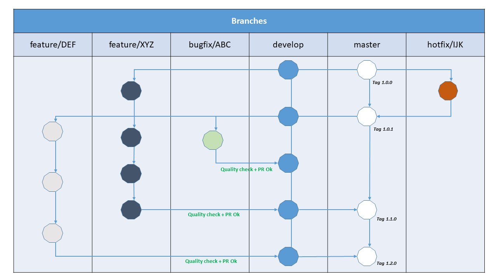

# Introduction

## Welcome to new comers

First off, thank you for considering contributing to Myason.

It's people like you that will make Myason a great tool.

## Why you should read our guidelines

Following these guidelines helps to communicate that you respect the time of the developers
managing and developing this open source project.

In return, we should reciprocate that respect in addressing your issue, assessing changes,
and helping you finalize your pull requests.

## Contributions we are looking for

Myason is an open source project and we love to receive contributions from our community — you!

There are many ways to contribute, from writing tutorials or blog posts, improving the
documentation, submitting bug reports and feature requests or writing code which can be
incorporated into Myason itself.

## Contributions we are NOT looking for

Please, don't use the issue tracker for support questions.

If your problem is Python, Scapy, Twisted specific, Stack Overflow is worth considering.

# Our responsabilities

* Ensure cross-platform compatibility for every change that's accepted. Windows, Mac,
Debian & Ubuntu Linux.
* Ensure that code that goes into core meets all requirements in 
[this checklist](PULL_REQUEST_CHECKLIST.md)
* Create issues for any major changes and enhancements that you wish to make.
Discuss things transparently and get community feedback.
* Don't add any classes to the codebase unless absolutely needed. Prefer using functions.
* Keep feature versions as small as possible, preferably one new feature per version.
* Be welcoming to newcomers and encourage diverse new contributors from all backgrounds.

# Our workflow

Our workflow is an hybrid of both **git flow** and **github flow**, implemented by OVH as **OVH UX Flow**.

Just like git flow, there are two main branches:

**master**: Which mainly only holds tags and is a reflection of the production.

**develop**: Which acts as a buffer for features and bugfix.
It is stable and we can start a production at any moment.
It's a bit like the release branch but already stable.

and 3 secondary branches:

**feature / XYZ**: Similar to gitflow.

**bugfix / XYZ**: this branch is used to fix bugs whose criticality does not require a hotfix.

**hotfix / XYZ**: Similar to gitflow. It allows to manage emergencies from master.

You will notice the presence of a bugfix branch and the absence of the release branch.

The stabilization phase is done on the feature and bugfix branches.
The big advantage is that at any time, a functional set on develop can be put into production.
On the other hand with gitFlow, if 3 features are found on develop, one pulls a release and the
tests invalidate one of the 3 features, it is the whole of the release which is found blocked.

In addition, just like github flow, our workflow is based on a few principles to respect, three in particular:

- Everything in develop is proddable
- No direct commit on develop
- Each branch of feature or bugfix undergoes a quality pass (functional tests, code review)

This allows us to ensure consistency across the flow.

What is happening in practice?

If it does not exist yet, you must first create the develop branch:

    $ git branch develop
    $ git push -u origin develop

Now, let's imagine Bob is wishing to start a new feature. It must create a separate branch for each feature:

    $ git checkout -b feature/awesome-feature develop

He develops on his side:

    $ git add <files>
    $ git commit -m "feature (menu): add items"
    $ git pull origin develop
    $ git push origin feature/awesome-feature

Then Bob creates a Pull-Request and sends in Quality Check.

Once validated, its code will be migrated to develop and put into production (master tagged version).

For versioning the master branch, we use [Semantic Versioning 2.0.0](https://semver.org/).

So our workflow is pretty close to git flow because it's like a git flow release contains only one feature.
But just as close to github flow, because the main branch is proddable at any time.

# Your first Contribution

Unsure where to begin contributing to Myason?

You can start by looking through the beginner and help-wanted issues:

* **Beginner issues**: issues which should only require a few lines of code, and a test or two.
* **Help wanted issues**: issues which should be a bit more involved than beginner issues.

Both issue lists are sorted by total number of comments.

While not perfect, number of comments is a reasonable proxy for impact a given change will have.

## For people who have never contributed to open source before

Here are a couple of friendly tutorials:

* http://makeapullrequest.com/
* http://www.firsttimersonly.com/

Working on your first Pull Request?

You can learn how from this *free* series, [How to Contribute to an Open Source Project on GitHub](https://egghead.io/series/how-to-contribute-to-an-open-source-project-on-github).  

At this point, you're ready to make your changes!
Feel free to ask for help; everyone is a beginner at first!

If a maintainer asks you to "rebase" your PR, they're saying that a lot of code has changed,
and that you need to update your branch so it's easier to merge.

# Getting started

## Quick walkthrough of how to submit a contribution.

For something that is bigger than a one or two line fix:

1. Create your own fork of the code
2. Do the changes in your fork
3. If you like the change and think the project could use it:

   * Be sure you have followed the code style for the project.
   * Note the Code of Conduct.
   * Send a pull request.

Small contributions such as fixing spelling errors, where the content is small enough to not
be considered intellectual property, can be submitted by a contributor as a patch.

As a rule of thumb, changes are obvious fixes if they do not introduce any new functionality 
or creative thinking.

As long as the change does not affect functionality, some likely examples include the following:

* Spelling / grammar fixes
* Typo correction, white space and formatting changes
* Comment clean up
* Bug fixes that change default return values or error codes stored in constants
* Adding logging messages or debugging output
* Changes to ‘metadata’ files like .gitignore, build scripts, etc.
* Moving source files from one directory or package to another

# How to report a bug

## Security disclosures first!

If you find a security vulnerability, do NOT open an issue. Email mail@thierry-decker.com instead.

Any security issues should be submitted directly to mail@thierry-decker.com.

In order to determine whether you are dealing with a security issue, ask yourself these two questions:

* Can I access something that's not mine, or something I shouldn't have access to?
* Can I disable something for other people?

If the answer to either of those two questions are "yes", then you're probably dealing with a
security issue.

Note that even if you answer "no" to both questions, you may still be dealing with
a security issue, so if you're unsure, just email us at mail@thierry-decker.com.

## How to file a bug report?

When filing an issue, make sure to answer these five questions:

1. What version of Python are you using?
2. What operating system and processor architecture are you using?
3. What did you do?
4. What did you expect to see?
5. What did you see instead?
