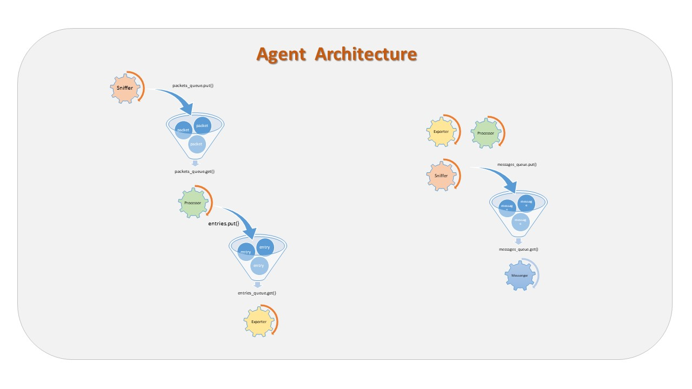
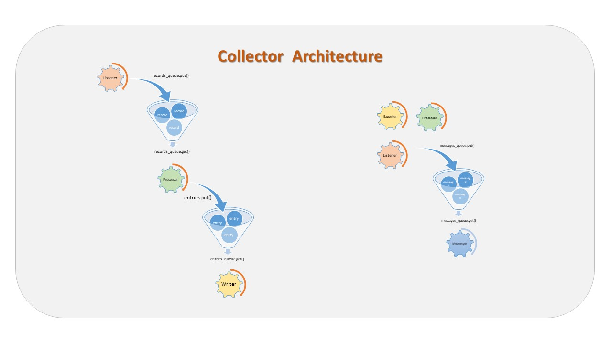

# Myason Project

Myason aims to become a traffic engineering tool allowing, in the long term, a fine analysis
of application flows transiting on a network of any size.

## Myason documents

- [Code of Conduct](CODE_OF_CONDUCT.md)
- [Contributions](CONTRIBUTING.md)
- [Licence](LICENCE.md)
- [Authors summary](AUTHORS.md)
- [Project history](HISTORY.md)

## Technologies

Myason developement is currently based on following technologies:

- [Python (3.7)](https://www.python.org)
- [Scapy (2.4.2)](https://scapy.net)
- [PyYaml (3.13)](https://pyyaml.org/wiki/PyYAML)
- [ifaddr (0.1.6)](https://github.com/pydron/ifaddr)
- [cryptography (2.5)](https://pypi.org/project/cryptography)

We strongly encourage using virtual environnements in the developement process. 

# Application usage

## Myason:

    python myason.py [-h] {agent,collector,ifconfig,keygen} ...

    positional arguments:

        {agent,collector,ifconfig}
            agent           agent help
            collector       server help
            ifconfig        Prints list of available adapters
            keygen          Generates a Fernet key

    optional arguments:

        -h, --help show this help message and exit

## Myason agent:

    python myason.py agent [-h]  [-lc LOGGER_CONF] [-ac AGENT_CONF]

        optional arguments:
            -h, --help          show this help message and exit
            -lc LOGGER_CONF,    --logger-conf LOGGER_CONF
            -ac AGENT_CONF,     --agent-conf AGENT_CONF

## Myason collector:

    python myason.py collector [-h]  [-lc LOGGER_CONF] [-cc COLLECTOR_CONF]

        optional arguments:
            -h, --help          show this help message and exit
            -lc LOGGER_CONF,    --logger-conf LOGGER_CONF
            -cc COLLECTOR_CONF, --collector-conf COLLECTOR_CONF

## Myason ifconfig:

    python myason ifconfig [-h]

        optional arguments:
            -h, --help  show this help message and exit

## Myason keygen:

    python myason keygen [-h]

        optional arguments:
            -h, --help  show this help message and exit

# Application architecture

## Agent

A stack of four threads is running for each listenned interface :

- A sniffer in charge of capturing the packets.

- A packet processor in charge of the packets dissection.

- An exporter processor in charge of sending flow entries to a collector.

- A message processor in charge of the logging stuff of previous threads.

These threads communicate to each other by the mean of three thread-safe FIFO queues:

- A packets queue filled by the sniffer and consumed by the packet processor.

- A flows entries queue filled by the packet processor and consumed by
the exporter processor.

- A messages queue filled by the sniffer, the packet and the exporter processors
and consumed by the message processor.

### Packet processor

Everything begins with the **cache** and ends with the **exporter**.

The **cache** has a couple of basic jobs to do:

- Interrogate data header of the packet and either mark it as a new flow or add it to part of an existing flow.
- Keep track of the flow timers and other factors, and when a flow is considered _**complete**_,
send it to the exporter (if one exists) and delete the flow. This process is known as flow aging.

The cache only keeps information on current and non-expired flows.

Each flow is defined as having values that match the following 7 fields uniquely:

- Source IP address
- Destination IP address
- Source port number
- Destination port number
- Layer 3 protocol type
- ToS byte value
- IfIndex number, also called the logical interface number

When a packet is processed and **all seven of these fileds match** an existing flow, it's not considered a
new flow but part of an existing flow. If any part of these seven fields doesn't exactly match an existing
flow, it's then a new flow and a new flow record is created.

These above fields are the **key fields**.

The following fields are **non-key fields** and are stored in the flow record identified by the **key fields**.

- Bytes
- Packets
- Output interface IfIndex
- Flow start and finish time
- Next hop IP
- Network masks
- TCP flags
- Source and destination BGP AS numbers

The **cache aging** 

The agent may have a limited amount of memory to store information, so at some point the device has to make
room for new flows. This is where flow aging and exporting comes into play.

The packet processor keeps track of of several factors regarding the flows and the status of the cache itself.

Here are the factors the agent uses to age flows and either delete them or export to a collector and
then delete. These are listed in order of precedence:

- Cache maximum size (max number of flow records).
- A TCP connection has been terminated by a RST (reset) or FIN (finish) flag in the flow.
- An active flow timer or inactive flow timer limit is reached.

### Exporter processor

The exporter processor sends the aged flow entries to the collector which is in
charge of storing them.

The entries are marshalled to a json string, base 64 encoded and then sent to the
collector.

## Collector

Three thread type are running:

- A Listener

- A (configurable number of) processor

- A (configurable number of) writer

- A messenger

## Payloads encryption

### Fernet Spec

We use fernet format for encrypting the payloads sent from agants to collectors

This [document](https://github.com/fernet/spec/blob/master/Spec.md) describes version 0x80
(currently the only version) of the fernet format.

Each encrypted message (refered to as a "fernet token") is checked upon a maximum of 5 (five) seconds
TTL and is rejected if older than this.

Code is automatically reviewed with 
